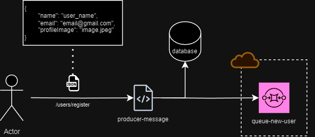
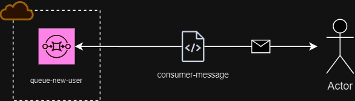

Códigos criado para estudos dos serviços da AWS

### Message Producer
Código responsável por receber um JSON com alguns dados de usuário, guardar em um banco de dados e enviar para uma SQS

#

### Message Consumer 
Utilizando uma lib, toda vez que uma mensagem chega na fila, ela é consumida e um email é enviado para o novo usuário registrado

